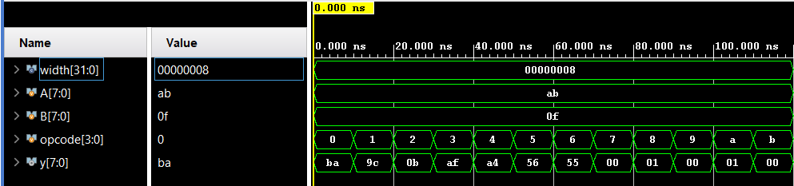

# Parameterized ALU

A basic ALU written in Verilog. The data width can be changed using a parameter. The default width is 8 bits.

## Operations
- Addition
- Subtraction
- AND
- OR
- XOR
- Left Shift
- Right Shift
- Comparisons (==, >, <, >=, <=)

## Files
- alu.v - the ALU module
- alu_tb.v - testbench

## Tools
Xilinx Vivado (XSim) for simulation

